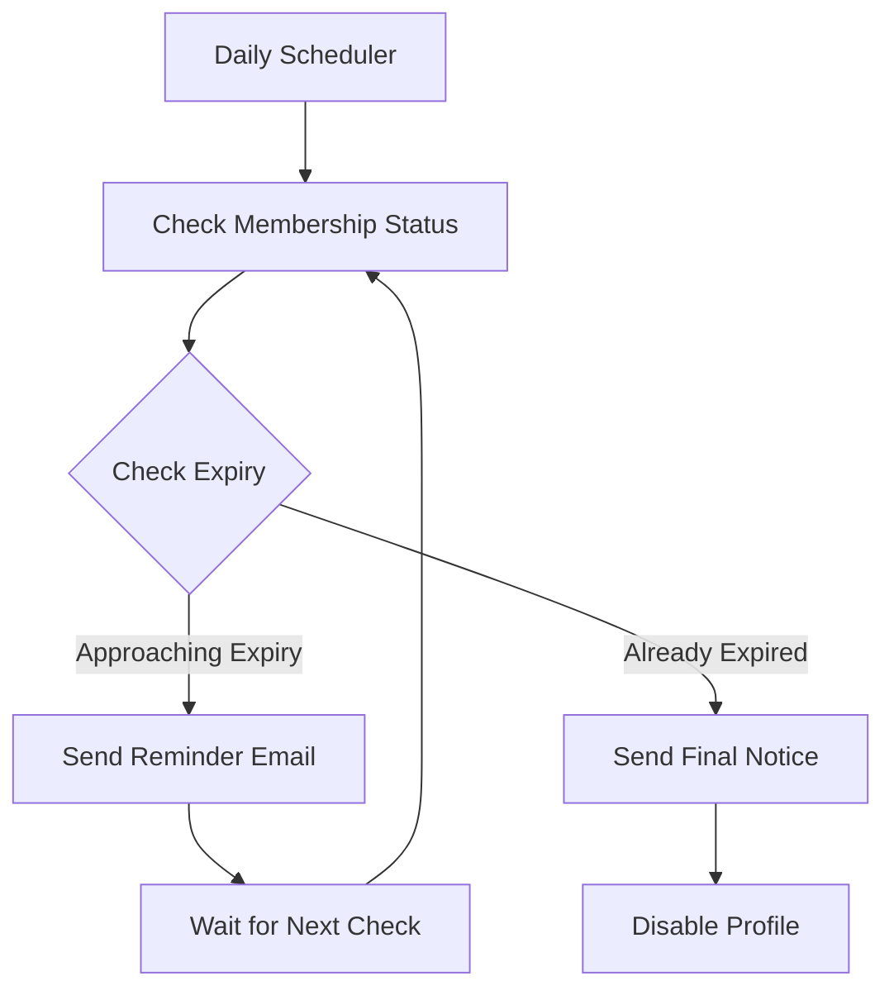

# Membership Reminder Process Flow

## Overview
This document outlines the automated membership reminder system that sends notifications to members before their membership expires and handles expired memberships.

## Process Flow Diagram



## Components

### 1. Settings Management
- **Location**: `/settings/membership-reminders` (Admin access only)
- **Default Setting**: 15 days before expiry
- **Configurable Range**: 1-90 days
- **Database**: Uses `settings` table with key `membership_reminder_days`

### 2. Reminder Schedule
- Runs daily via Laravel scheduler
- Command: `membership:send-expiry-reminders`
- Checks two conditions:
  1. Members approaching expiry (within configured days)
  2. Members whose membership has expired

### 3. Email Notifications
- **Pre-expiry Reminders**:
  - Start: X days before expiry (configurable)
  - Frequency: Daily until expiry
  - Content: Includes expiry date and renewal instructions
- **Expiry Notice**:
  - Sent on the day of expiry
  - Notifies about account deactivation
  - Includes instructions for reactivation

### 4. Profile Management
- **Active Status**:
  - Tracked by `is_active` flag in users table
  - Automatically set to `false` upon expiry
- **Directory Visibility**:
  - Only active members appear in directory
  - Expired members are hidden automatically

## Technical Implementation

### Database Tables
1. **settings**
   ```sql
   CREATE TABLE settings (
       id bigint PRIMARY KEY,
       key varchar(255) UNIQUE,
       value text,
       type varchar(255),
       description text,
       created_at timestamp,
       updated_at timestamp
   );
   ```

2. **users** (relevant fields)
   ```sql
   ALTER TABLE users ADD COLUMN is_active boolean DEFAULT true;
   ```

### Key Files
1. **Command**:
   - Location: `app/Console/Commands/SendMembershipExpiryReminders.php`
   - Purpose: Handles the reminder logic and profile deactivation

2. **Email Template**:
   - Location: `resources/views/emails/membership-expiry-reminder.blade.php`
   - Purpose: Defines the email content and format

3. **Settings Controller**:
   - Location: `app/Http/Controllers/SettingsController.php`
   - Purpose: Manages reminder day configuration

### Scheduling
```php
// bootstrap/app.php
->withSchedule(function (Schedule $schedule) {
    $schedule->command('membership:send-expiry-reminders')->daily();
})
```

## Testing

### Manual Testing
1. Set up test members with approaching expiry dates:
   ```sql
   UPDATE users SET membership_expires_at = DATE_ADD(CURDATE(), INTERVAL 14 DAY) WHERE id = X;
   ```

2. Run reminder command:
   ```bash
   php artisan membership:send-expiry-reminders
   ```

3. Check email notifications and member status

### Automated Testing
- Unit tests for reminder logic
- Integration tests for email sending
- Feature tests for settings management

## Maintenance

### Regular Tasks
1. Monitor email delivery success rates
2. Check for failed reminder jobs
3. Review and update email templates as needed
4. Audit member activation/deactivation logs

### Troubleshooting
1. Check Laravel logs for email sending issues
2. Verify scheduler is running correctly
3. Confirm database connectivity
4. Validate email configuration

## Security Considerations
1. Admin-only access to settings
2. Protected routes for all reminder management
3. Sanitized email content
4. Rate limiting on renewal endpoints

## Future Enhancements
1. Customizable email templates
2. Multiple reminder intervals
3. SMS notifications
4. Automated renewal processing
5. Member dashboard notifications